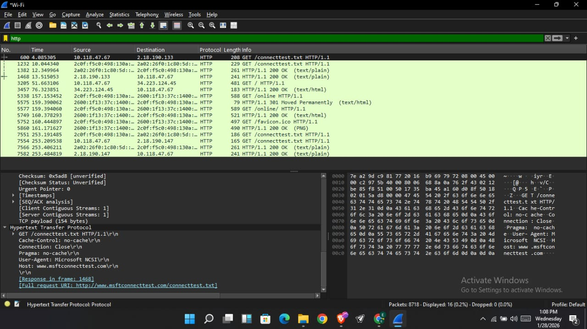

# Network Traffic Analysis Labs

## Focus
- Understand live network traffic
- Identify DNS, TCP, TLS, HTTPS flows
- Learn packet capture & filtering

## Tools
- Wireshark (Windows)
- Browser traffic (Edge, Google)

## Lab Status
- Capture: ✅ Completed
- Filters Applied: DNS, TLS
- Data Saved: .pcapng

## Key Observations
- DNS queries resolve domains like google.com, mtalk.google.com
- HTTPS traffic is encrypted (TLS handshake visible, payload hidden)
- Client Hello observed before encrypted application data

### Week 2 Update

#### What I Practiced & Studied
- Reviewed the OSI model and how data is encapsulated and decapsulated across layers
- Connected OSI theory to real network traffic previously captured in Wireshark
- Studied the CIA triad (Confidentiality, Integrity, Availability) and its relevance to network security
- Reviewed common cyber attack types and their high-level impact
- Identified key tools to focus on as a beginner, including Wireshark and Splunk

#### What Clicked
- Encapsulation explains why multiple protocol headers appear in packet captures
- DNS resolution occurs before HTTPS communication begins
- TLS encrypts application-layer data before it is handed to TCP, providing confidentiality
- Even when payloads are encrypted, network metadata remains visible

#### Temporary Constraint
- Hands-on labs paused due to a hardware issue (charger failure)
- Continued learning through review, documentation, and reflection

#### Next Week Focus
- Resume live traffic capture in Wireshark
- Apply OSI layer mapping directly to observed packets
- Practice protocol-based filtering (DNS, TLS, HTTP/HTTPS)
- Begin introductory exposure to log analysis concepts (Splunk)

## Week 3 – HTTP vs HTTPS Traffic Analysis

### Objective
Compare unencrypted HTTP traffic with encrypted HTTPS traffic using Wireshark to understand visibility, encryption, and protocol behavior.

### Tools Used
- Wireshark

### What I Did
- Captured live network traffic on an active interface
- Visited an HTTP website (`http://neverssl.com`)
- Visited an HTTPS website (`https://www.google.com`)
- Applied protocol filters (`http`, `tls`, `dns`) to analyze traffic differences

### Key Observations
- HTTP traffic is visible in plain text, including request details and headers
- HTTPS traffic is encrypted; only TLS handshakes and metadata are visible
- DNS resolution occurs before both HTTP and HTTPS connections
- TLS encrypts application-layer data before it is handed to TCP for transport

### Evidence

### week 4 Splunk intro
Splunk Fundamentals – Theory & Query Design (Week Update)
This week focused on building a solid theoretical foundation in Splunk and SOC log analysis, with emphasis on understanding how analysts explore, filter, and interpret log data during investigations.
I studied the core structure of Splunk, including:
How data is stored using indexes
How logs are associated with hosts and sources
How the Search Processing Language (SPL) is used to transform raw logs into actionable insights
Key SPL Concepts Practiced
Data Enumeration
Explored all available logs to understand what data sources are present before analysis.
Log Volume Analysis
Identified high-volume log sources to detect abnormal behavior or misconfigured systems.
Authentication Failure Detection
Designed queries to surface failed login attempts, useful for identifying brute-force attacks or unauthorized access attempts.
Time-Based Analysis
Used time-series logic to detect traffic spikes and unusual activity patterns over time.
Although I was unable to complete hands-on labs due to environment and installation constraints, I focused on understanding SOC workflows, detection logic, and how Splunk integrates with tools like Wireshark for deeper packet-level analysis.
This phase strengthened my ability to reason like a SOC analyst — knowing what to look for, why it matters, and how to escalate investigations once anomalies are identified.

## Week 5 – Splunk Installation Attempt

### Objective
Install Splunk Enterprise locally to begin hands-on log analysis and lab configuration.

### Environment
- Operating System: Windows
- Installer: Splunk Enterprise (Windows x64 MSI)
- Source: Official Splunk website

### Process
1. Downloaded the Splunk Enterprise MSI installer.
2. Launched the installer.
3. Monitored system performance using Task Manager during setup.

### Issue Encountered
The installation stalled at the "Preparing to install" phase and did not progress.

### Observations
- CPU usage reached 100% during installation.
- Memory usage exceeded 80%.
- Disk activity was active but installation did not advance.
- Windows Security indicated detected threats during the process.

### Troubleshooting Steps
- Reviewed system resource utilization in Task Manager.
- Restarted the system to clear potential installer lock.
- Considered running installation via elevated Command Prompt (msiexec).
- Planned temporary disabling of real-time protection during installation.

### Outcome
Installation did not complete successfully. The likely causes include high system resource utilization and possible security interference.

### Next Steps
- Perform clean installation using administrative privileges.
- Temporarily disable Windows Defender during installation.
- Reattempt setup and monitor system performance.
- Explore alternative deployment options if necessary.

### Evidence

https://github.com/DeEmperor2/network-traffic-analysis-labs/blob/main/IMG_20260218_203228_029.jpg

https://github.com/DeEmperor2/network-traffic-analysis-labs/blob/main/IMG-20260202-WA0033.jpg
