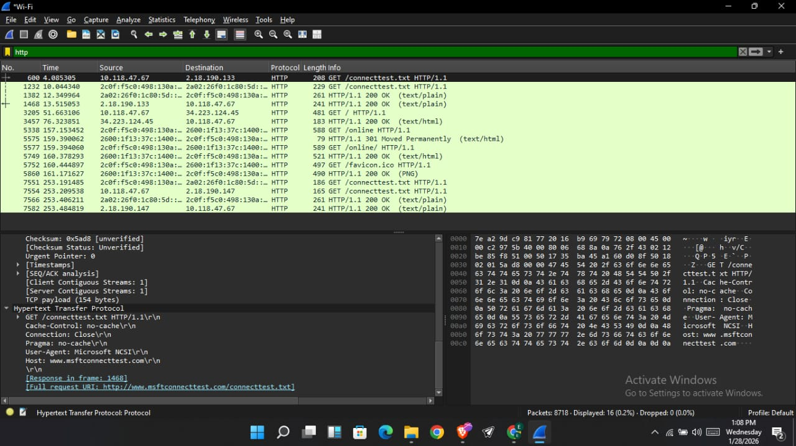

# Network Traffic Analysis Labs

## Focus
- Understand live network traffic
- Identify DNS, TCP, TLS, HTTPS flows
- Learn packet capture & filtering

## Tools
- Wireshark (Windows)
- Browser traffic (Edge, Google)

## Lab Status
- Capture: ✅ Completed
- Filters Applied: DNS, TLS
- Data Saved: .pcapng

## Key Observations
- DNS queries resolve domains like google.com, mtalk.google.com
- HTTPS traffic is encrypted (TLS handshake visible, payload hidden)
- Client Hello observed before encrypted application data

### Week 2 Update

#### What I Practiced & Studied
- Reviewed the OSI model and how data is encapsulated and decapsulated across layers
- Connected OSI theory to real network traffic previously captured in Wireshark
- Studied the CIA triad (Confidentiality, Integrity, Availability) and its relevance to network security
- Reviewed common cyber attack types and their high-level impact
- Identified key tools to focus on as a beginner, including Wireshark and Splunk

#### What Clicked
- Encapsulation explains why multiple protocol headers appear in packet captures
- DNS resolution occurs before HTTPS communication begins
- TLS encrypts application-layer data before it is handed to TCP, providing confidentiality
- Even when payloads are encrypted, network metadata remains visible

#### Temporary Constraint
- Hands-on labs paused due to a hardware issue (charger failure)
- Continued learning through review, documentation, and reflection

#### Next Week Focus
- Resume live traffic capture in Wireshark
- Apply OSI layer mapping directly to observed packets
- Practice protocol-based filtering (DNS, TLS, HTTP/HTTPS)
- Begin introductory exposure to log analysis concepts (Splunk)

## Week 3 – HTTP vs HTTPS Traffic Analysis

### Objective
Compare unencrypted HTTP traffic with encrypted HTTPS traffic using Wireshark to understand visibility, encryption, and protocol behavior.

### Tools Used
- Wireshark

### What I Did
- Captured live network traffic on an active interface
- Visited an HTTP website (`http://neverssl.com`)
- Visited an HTTPS website (`https://www.google.com`)
- Applied protocol filters (`http`, `tls`, `dns`) to analyze traffic differences

### Key Observations
- HTTP traffic is visible in plain text, including request details and headers
- HTTPS traffic is encrypted; only TLS handshakes and metadata are visible
- DNS resolution occurs before both HTTP and HTTPS connections
- TLS encrypts application-layer data before it is handed to TCP for transport

### Evidence

### week 4 Splunk intro
Splunk Fundamentals – Theory & Query Design (Week Update)
This week focused on building a solid theoretical foundation in Splunk and SOC log analysis, with emphasis on understanding how analysts explore, filter, and interpret log data during investigations.
I studied the core structure of Splunk, including:
How data is stored using indexes
How logs are associated with hosts and sources
How the Search Processing Language (SPL) is used to transform raw logs into actionable insights
Key SPL Concepts Practiced
Data Enumeration
Explored all available logs to understand what data sources are present before analysis.
Log Volume Analysis
Identified high-volume log sources to detect abnormal behavior or misconfigured systems.
Authentication Failure Detection
Designed queries to surface failed login attempts, useful for identifying brute-force attacks or unauthorized access attempts.
Time-Based Analysis
Used time-series logic to detect traffic spikes and unusual activity patterns over time.
Although I was unable to complete hands-on labs due to environment and installation constraints, I focused on understanding SOC workflows, detection logic, and how Splunk integrates with tools like Wireshark for deeper packet-level analysis.
This phase strengthened my ability to reason like a SOC analyst — knowing what to look for, why it matters, and how to escalate investigations once anomalies are identified.

## Week 5 – Splunk Installation Attempt

### Objective
Install Splunk Enterprise locally to begin hands-on log analysis and lab configuration.

### Environment
- Operating System: Windows
- Installer: Splunk Enterprise (Windows x64 MSI)
- Source: Official Splunk website

### Process
1. Downloaded the Splunk Enterprise MSI installer.
2. Launched the installer.
3. Monitored system performance using Task Manager during setup.

### Issue Encountered
The installation stalled at the "Preparing to install" phase and did not progress.

### Observations
- CPU usage reached 100% during installation.
- Memory usage exceeded 80%.
- Disk activity was active but installation did not advance.
- Windows Security indicated detected threats during the process.

### Troubleshooting Steps
- Reviewed system resource utilization in Task Manager.
- Restarted the system to clear potential installer lock.
- Considered running installation via elevated Command Prompt (msiexec).
- Planned temporary disabling of real-time protection during installation.

### Outcome
Installation did not complete successfully. The likely causes include high system resource utilization and possible security interference.

### Next Steps
- Perform clean installation using administrative privileges.
- Temporarily disable Windows Defender during installation.
- Reattempt setup and monitor system performance.
- Explore alternative deployment options if necessary.

### Evidence

https://github.com/DeEmperor2/network-traffic-analysis-labs/blob/main/IMG_20260218_203228_029.jpg

https://github.com/DeEmperor2/network-traffic-analysis-labs/blob/main/IMG-20260202-WA0033.jpg

### Week 6 — Splunk Enterprise Deployment & Internal Log Analysis

**Objective:**
Continue building SOC skills by mastering Splunk Enterprise on Windows and performing internal log analysis.

### Tasks Completed:

1. Installed Splunk Enterprise v10.2 on Windows x64.
2. Verified Splunkd service is running.
3. Accessed the web interface at http://127.0.0.1:8000.
4. Executed SPL queries:
   - index=_internal | head 20
   - index=_internal | stats count by sourcetype
   - index=_internal log_level=ERROR
5. Observed 5k+ internal events, including ERROR logs.
6. Captured timeline visualizations and statistics tables.
7. Screenshots taken:
   - Home dashboard ~ 
   - _internal logs timeline
   - SPL stats by sourcetype
   - Splunkd service running
   - Error log query results

### Reflection:

- Windows MSI install can freeze; manual start via 'splunk start' may be required.
- _internal logs provide immediate data for analysis and portfolio proof.
- Learned to navigate Splunk’s Web UI and execute SPL for SOC-style monitoring.

### Next Week Plan:

- Enable and ingest Windows Event Logs locally.
- Explore Security EventCode queries (e.g., 4625 failed logons).
- Capture analytical dashboards for portfolio enhancement.

### Week 7 — Internal Log Threat Hunting in Splunk

Objective:
Analyze internal logs to identify error patterns and noisy components, practicing SOC-style monitoring.

### Tasks Completed:

1. Opened Search & Reporting in Splunk Web.
2. Set Time Range: Last 24 hours.
3. Ran SPL query to view log level distribution:
   index=_internal | stats count by log_level | sort - count

   Result: INFO logs dominated (97,706 events).

4. Identified the most error-prone components:
   index=_internal log_level=ERROR | stats count by component | sort - count

   Result: [Top component name here] had the highest errors.

5. Visualized error trends over time:
   index=_internal log_level=ERROR | timechart count

   Result: Line chart showing error spikes and patterns over time.

### Screenshots Included:

1. Query and results for log level distribution.
2. Query and results showing error counts by component.
3. Timechart visualization of errors over time.

### Reflection:

- INFO logs dominate internal logs, which is expected in normal operations.
- ERROR logs help identify components that may require attention or troubleshooting.
- Using SPL queries and visualizations provides a practical introduction to SOC-style monitoring and log analysis.

### Next Week Plan:

- Install Splunk Add-on for Microsoft Windows.
- Enable ingestion of Windows Event Logs (Application, System, Security).
- Run security-related EventCode queries such as 4625 (failed logons) and 4624 (successful logons).
- Capture dashboards and visualizations for further portfolio documentation.

### Week 8 – Lab Environment Setup & Virtualization Troubleshooting

This week focused on rebuilding and stabilizing my cybersecurity lab environment after system changes. The primary goal was to properly set up the tools required for both offensive (attacker) and defensive (SOC) workflows.

I successfully downloaded and installed core tools including Splunk Enterprise, Wireshark, and Oracle VM VirtualBox. A major part of the week involved troubleshooting issues related to importing and running a Kali Linux virtual machine.

During setup, I encountered multiple boot errors caused by incorrect VM configuration and confusion between different virtual machine file formats (.ova, .vdi, .vbox). Through repeated attempts and debugging, I learned how to properly extract virtual machine files, identify the correct configuration file (.vbox), and manually add the VM into VirtualBox.

Key concepts understood this week include:
- Differences between virtual machine formats (.ova vs .vdi vs .vbox)
- Proper method of importing vs manually attaching virtual disks
- Boot order configuration and its impact on VM startup
- Resource allocation (RAM, CPU) for stable virtual machine performance
- Common causes of “no operating system found” errors in virtualization

Although I did not fully complete the Kali Linux boot process, I now understand the correct workflow for setting up and troubleshooting virtual environments.

This week emphasized problem-solving and environment setup, reinforcing the importance of persistence and technical understanding when working with complex systems.

### Next Week Plan
- Successfully boot Kali Linux virtual machine
- Configure network communication between virtual machines and host system
- Begin initial lab testing (basic reconnaissance and system interaction)
- Start ingesting logs into Splunk for analysis

### Key Takeaway
Setting up a cybersecurity lab requires more than installing tools — it involves understanding system architecture, diagnosing failures, and building a reliable environment for both attack and defense scenarios.

### Week 9 – Kali Linux Virtual Machine Successfully Deployed

This week marked a major milestone in my cybersecurity lab development: I successfully booted and launched Kali Linux inside VirtualBox after previous weeks of virtualization issues and failed boot attempts.

The process involved troubleshooting multiple configuration problems, understanding the differences between VM file types (.vbox, .vdi, .ova), and learning how to properly register and launch prebuilt virtual machines.

Key progress made this week:
- Successfully deployed Kali Linux in VirtualBox
- Resolved previous boot and configuration errors
- Improved understanding of virtualization workflows
- Established a functional attacker environment for future lab exercises

This milestone transitions my lab from setup phase into operational phase. With Kali now working, I can begin practical offensive security tasks such as reconnaissance, scanning, enumeration, and controlled attack simulations.

### Next Week Plan
- Configure networking between Kali and target systems
- Test connectivity (ping / IP discovery)
- Begin basic reconnaissance using Nmap
- Capture traffic with Wireshark during scans
- Start generating logs for Splunk analysis

### Key Takeaway
Persistence during technical failure is a core cybersecurity skill. Solving environment and deployment problems is part of real-world security work, not separate from it.
### Week 10 – SOC Lab Deployment, Network Reconnaissance & Log Analysis

This week marked a major transition from environment setup into practical cybersecurity operations. I successfully built and utilized a functional home SOC lab integrating both offensive and defensive tools.

On the offensive side, I used Kali Linux to perform internal reconnaissance using Nmap. The scan confirmed host availability within the lab network and provided insight into basic network behavior.

To analyze network-level activity, I used Wireshark to capture live traffic during scanning. Using filters such as ARP, I was able to observe device communication and understand how systems discover and interact with each other on the network.

On the defensive side, I configured Splunk to ingest Windows Event Logs from the host machine. I verified log ingestion by querying Application and Security logs, gaining visibility into system activity and event generation.

To further test detection capability, I generated user and system activity (application launches and interactions) and analyzed corresponding logs in Splunk. This introduced the concept of correlating actions with logged events.

Key achievements this week:
- Successfully deployed and operated a Kali Linux attacker environment
- Performed network reconnaissance using Nmap
- Captured and analyzed network traffic using Wireshark
- Configured Splunk SIEM to ingest Windows Event Logs
- Queried and investigated system activity through log analysis

### Next Week Plan
- Improve log visibility (enable and troubleshoot missing System logs)
- Generate and detect specific security events (e.g., failed logins)
- Begin structured threat detection use cases in Splunk
- Enhance documentation and publish first cybersecurity project on GitHub

###Screenshots 
- Kali environment 

- Nmap reconnaissance 

- Wireshark network traffic 

- Working Splunk 

### Key Takeaway
Cybersecurity is not just about running tools, but about understanding and connecting attacker activity, network behavior, and system logs. This week established the foundation for real-world detection and analysis workflows.
